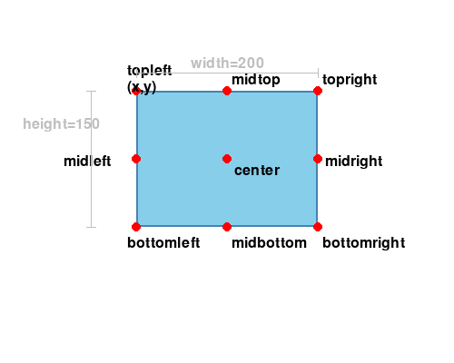

```text
図形・文字を描く方法と、グラフィックを動かす方法を学びましょう
以下のサンプルファイルを見ながら実際に動かしてみよう
```

# 目次
- [目次](#目次)
- [図形や文字を描く](#図形や文字を描く)
  - [画面の座標系](#画面の座標系)
  - [色の指定方法](#色の指定方法)
  - [図形を描く](#図形を描く)
  - [文字列を描く](#文字列を描く)
    - [ステップ1.フォントを用意する](#ステップ1フォントを用意する)
    - [ステップ2.そのフォントを使って、文字列の画像を作る](#ステップ2そのフォントを使って文字列の画像を作る)
- [グラフィックを動かす](#グラフィックを動かす)
  - [位置と大きさを表す変数：Rect](#位置と大きさを表す変数rect)
    - [基準点](#基準点)
  - [位置を繰り返し変え続ける](#位置を繰り返し変え続ける)
    - [ステップ1.ゲームの準備をする](#ステップ1ゲームの準備をする)
    - [ステップ5.絵を描いたり、判定したりする](#ステップ5絵を描いたり判定したりする)
    - [ステップ6.オブジェクトを表示する](#ステップ6オブジェクトを表示する)
- [練習問題1](#練習問題1)
  - [四角を斜めに移動させて、その後拡大させる](#四角を斜めに移動させてその後拡大させる)

---

# 図形や文字を描く

サンプル: [01_draw_shapes/ex01.py](01_draw_shapes/ex01.py) / [02_draw_text/ex02.py](02_draw_text/ex02.py)

## 画面の座標系
pygameの画面の座標は、左上が原点(0,0)になり、
右に進むほどx軸の値が増え、下に進むほどy軸の値が増える

## 色の指定方法

詳細: [color_code.md](color_code.md)

pygameで色を指定する方法は主に3種類ある。

```python
pg.Color("RED")            # 色名（文字列）
pg.Color(255, 0, 0)        # RGB値
pg.Color(255, 0, 0, 128)   # RGBA値（透明度あり）
```

コードの中では `pg.Color("RED")` のように色名を使うのが一番わかりやすい。
よく使う色と RGB 値の対応は [color_code.md](color_code.md) を参照。

## 図形を描く
```python
# 四角形を描く
pg.draw.rect(screen, 色, (x, y, 幅, 高さ))
# pygameでは(x, y, 幅, 高さ)をRectというデータで扱う

# 線を引く
pg.draw.line(screen, 色, (x1,y1), (x2,y2), 太さ)
# 開始位置(x1,y1),終了位置 (x2,y2)

# 円を描く
pg.draw.ellipse(screen, 色, (x, y, 幅, 高さ), 太さ)
# 円をギリギリ囲む四角形の大きさで指定する
```

## 文字列を描く
pygameでは図形か画像しか表示できないため、画像にしてから表示する

### ステップ1.フォントを用意する
```python
"""font.Font関数で文字サイズを指定する
デフォルトのフォントを使う場合は、Noneと指定する"""
font = pg.font.Font(None, 文字サイズ)
```

### ステップ2.そのフォントを使って、文字列の画像を作る
```python
"""render関数で文字列から画像を作る
表示させたい文字列と文字の色を指定する
(Trueは文字列を滑らかにする指定)"""
画像変数 = font.render(文字列, True, 色)
```

---

# グラフィックを動かす

サンプル: [03_rect_object/ex04.py](03_rect_object/ex04.py)

## 位置と大きさを表す変数：Rect
ゲームの中では、ただキャラクタを移動させるだけでなく、
「壁や敵と衝突したか」を調べる必要がある
そのために「x座標, y座標, 幅, 高さ」をひとまとめにしたデータをRectという

変数 = pg.Rect(x, y, 幅, 高さ)

Rectのそれぞれの値には、変数に".(ドット)"と「x,y,width,height」をつけてアクセスする

サンプル: [03_rect_object/ex03.py](03_rect_object/ex03.py)

### 基準点
Rectの`(x, y)`は**左上隅**が基準点になる


そのため、中心や右端・下端を基準にしたい場合は以下の属性を使う

| 属性 | 意味 |
| --- | --- |
| `rect.x` / `rect.y` | 左上のx,y座標 |
| `rect.topleft` | 左上 (x, y) |
| `rect.center` | 中心 (x, y) |
| `rect.centerx` / `rect.centery` | 中心のx / y座標 |
| `rect.right` | 右端のx座標 |
| `rect.bottom` | 下端のy座標 |

## 位置を繰り返し変え続ける
### ステップ1.ゲームの準備をする
```python
"""ゲームの準備の中で、図形をどこに表示させるかを変数myrectに用意する"""
myrect = pg.Rect(100,100,100,150)
```

### ステップ5.絵を描いたり、判定したりする
```python
"""ループの中でmyrectのxに1を足して、表示させる位置を少し右に移動させる
draw.rect関数で、表示させる位置と幅と高さをmyrectで指定する"""
myrect.x += 1
pg.draw.rect(screen, pg.Color("RED"), myrect)
```

### ステップ6.オブジェクトを表示する
```python
"""「pg.display.update()」で表示させるときに
「clock.tick(1秒間に処理する回数)」でスピードを調整する"""
pg.display.update()
clock.tick(60)
```

---

# 練習問題1

## 四角を斜めに移動させて、その後拡大させる

> 問題: [question/question1.py](question/question1.py) / 解答: [question/answer/answer1.py](question/answer/answer1.py)
